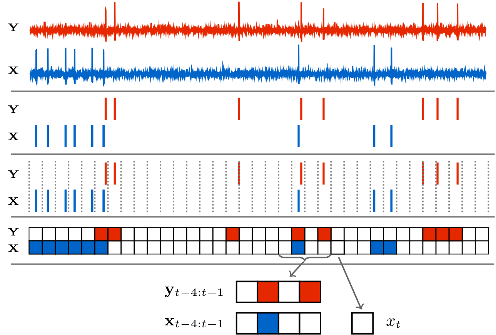
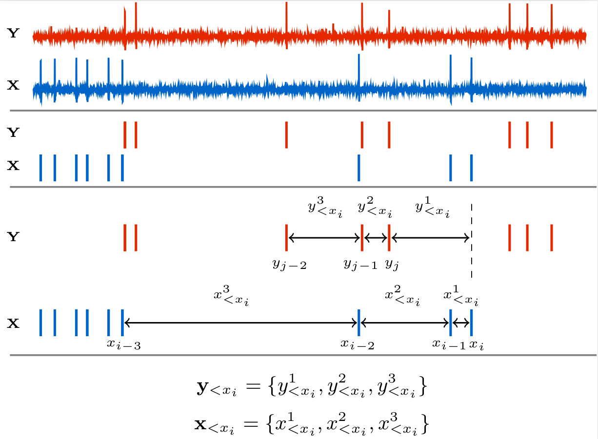
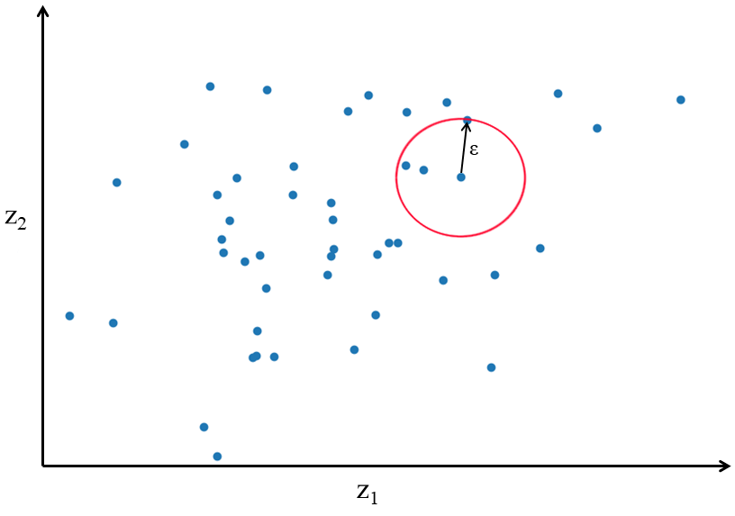

# CoTETE.jl

*Continuous-Time Event-based Transfer Entropy*

```@meta
CurrentModule = CoTETE
```

This package allows one to estimate the Transfer Entropy (TE) between event-based time series
(such as spike trains or social media post times) in continuous time (that is, without discretising
time into bins).

It contains implementations of the estimator and local permutation scheme presented in
[Estimating Transfer Entropy in Continuous Time Between Neural Spike Trains or Other
Event-Based Data](https://doi.org/10.1101/2020.06.16.154377).

Transfer entropy is a measure of information flow between a source and a target time series [^1][^2].
In the context of event-based data, it measures how much the knowledge of the times of historic events
in the source decreases our uncertainty about the occurrence of events in the target.
Getting a clearer picture of what TE is measuring is easiest done, initially at least, in discrete time.



The above diagram shows the raw membrane potentials of two neurons from which spikes are extracted.
Time is then discretised into bins of width ``\Delta t`` to give us two binary time series (labelled
``X`` and ``Y`` for the source and target, respectively). The binary values these processes take on
signify the presence of an event (spike) in each bin. For each such value ``x_t`` in the target
process, we can ask what the probability of that value is given the history of the target
process ``p(x_t \, | \, \mathbf{x}_{<t})``. In practice, such conditional probabilities can only be estimated for histories
of limited length. As such, we use a history embedding of ``m`` bins. This embedding is usually chosen to be the ``m`` bins
preceding the ``t``-th bin under consideration. In the above diagram, ``m`` is chosen to be 4, and so we are estimating
``p(x_t \, | \, \mathbf{x}_{t-4:t-1})``. So, for the specific example ``x_t`` pulled out of the diagram,
we are asking what the probability of the bin having a value of ``0`` is (that is, the probability
of there being no spike in the bin), given that the preceding ``4`` bins were ``\{0, 1, 0, 0\}``.

We can also ask what the probability of ``x_t`` is given history embeddings of both the source and
the target: ``p(x_t \, | \, \mathbf{x}_{t-4:t-1}, \mathbf{y}_{t-4:t-1})``. Looking at our specific
pulled-out example again, we would be asking for the probability of the target bin having a value of
``0`` given that the preceding ``4`` bins of the target were ``\{0, 1, 0, 0\}`` and the preceding
``4`` bins of the source were ``\{0, 1, 0, 1\}``.

We can then compare the probabilities ``p(x_t \, | \, \mathbf{x}_{t-4:t-1}, \mathbf{y}_{t-4:t-1})``
and ``p(x_t \, | \, \mathbf{x}_{t-4:t-1})`` to determine whether the knowledge of the source reduced
our uncertainty about the next state of the target.
If ``p(x_t \, | \, \mathbf{x}_{t-4:t-1}, \mathbf{y}_{t-4:t-1}) > p(x_t \, | \, \mathbf{x}_{t-4:t-1})``
then the source allowed us to better predict the next state of the target and so reduced our uncertainty.
Conversely, if ``p(x_t \, | \, \mathbf{x}_{t-4:t-1}, \mathbf{y}_{t-4:t-1}) < p(x_t \, | \, \mathbf{x}_{t-4:t-1})``
then the source was misinformative [^3].

One way of turning these two probabilities into a measurement of "informativeness" is to take the log
of their ratio. We shall label this ``\mathbf{t}_{Y \to X}``.
```math
 \mathbf{t}_{Y \to X} = \ln\frac{p(x_t \, | \, \mathbf{x}_{<t}, \mathbf{y}_{<t})}{p(x_t \, | \, \mathbf{x}_{<t})}
```
We use ``\mathbf{t}_{Y \to X}^{l, m}`` for the same quantity calculated for specific source and target history
embedding lengths.
```math
 \mathbf{t}_{Y \to X}^{l, m} = \ln\frac{p(x_t \, | \, \mathbf{x}_{t-m:t-1}, \mathbf{y}_{t-l:t-1})}{p(x_t \, | \, \mathbf{x}_{t-m:t-1})}
```

``\mathbf{t}_{Y \to X}`` will be positive in cases where the source is informative and negative when it is
misinformative. However, it is only a measure of how informative the source was in
*that specific time bin*. In many cases, such as network inference, we are interested in how
generally informative one time series is of another. As such we take the average of ``\mathbf{t}_{Y \to X}``
and label it ``\mathbf{T}_{Y \to X}``.
```math
\mathbf{T}_{Y \to X} = \frac{1}{N}\sum_{t=1}^{N}
\ln\frac{
  p(x_t \, | \, \mathbf{x}_{<t}, \mathbf{y}_{<t})
  }{
    p(x_t \, | \, \mathbf{x}_{<t})
  }
```
The average here is taken over the ``N`` time bins of the target series. ``\mathbf{T}_{Y \to X}`` is
the transfer entropy. In order to ensure that we have a quantity that converges in the limit of small
bin size, we usually normalise the TE by the bin size ``\Delta t``, to arrive at the transfer entropy rate
``\mathbf{\dot{T}}_{Y \to X} = \frac{1}{\Delta t}\mathbf{T}_{Y \to X}``. This rate is the normalised
[conditional mutual information](https://en.wikipedia.org/wiki/Conditional_mutual_information)
between the  current time bin of the target and the history of the source, conditioned
on the history of the target. That is:
```math
\mathbf{\dot{T}}_{Y\rightarrow X}
	=
	\frac{1}{\Delta t}
	I\left(
		X_t \, ; \, \mathbf{Y}_{<t}
		\, \middle| \,
		\mathbf{X}_{<t}
	\right)
```
Due to the fact that the mutual information is non-negative, the transfer entropy rate is similarly
non-negative, despite the fact that the individual ``\mathbf{t}_{Y \to X}`` terms
that make up the average can be negative.

The estimation of ``\mathbf{\dot{T}}_{Y \to X}`` on event-based data has traditionally been done in
a very straightforward fashion. After performing time discretisation, for each time bin ``t``, we
estimate the probability of the value in that bin given its history embedding,
``p(x_t \, | \, \mathbf{x}_{t-m:t-1})`` using a plug-in or histogram estimator. Specifically, we
find every occurrence of the embedding ``\mathbf{x}_{t-m:t-1}`` and record the values in the
subsequent bin. The estimated probability is then the number of times we observed the same value as
``x_t`` divided by the total number of values recorded. Going back to our example, for the specific
bin pulled out, we would find all instances of the pattern ``\{0, 1, 0, 0\}`` in the discretised
time series. We would then count how many of these instances were followed by a ``0``. The estimated
conditional probability is then the ratio of the number of instances follwed by a ``0`` to the total
number of instances. ``p(x_t \, | \, \mathbf{x}_{t-m:t-1}, \mathbf{y}_{t-l:t-1})`` is estimated in
a similar fashion, except we are now looking for instances where both
``\mathbf{x}_{t-m:t-1}`` and ``\mathbf{y}_{t-l:t-1}`` match. We take the log of the ratio of these
estimated probabilities to provide an estimate for ``\mathbf{t}_{Y \to X}``.
We then repeat this procedure for every time bin, find the average, normalise by ``\Delta t``
and, wham, we have estimated the TE!!
(There are more computationally efficient ways of arriving at the same quantity)

Unfortunately, there are large limitations to estimating the TE in this fashion. Perhaps the most
important of these is that when we perform time-discretisation, we are applying a lossy transformation
to the data. So long as our bin size is larger than the time precision of the device used to record
our data (as is usually the case), once the discretisation has been performed we cannot reconstruct
the original time series in full detail - we have lost information.
There could be history dependencies in the original data which occurr over a time scale smaller than
the bin size. The discrete-time estimator will be blind to these relationships.
The implication of this is that the discrete-time estimator is not guaranteed
to converge to the true value of the TE in the limit of infinite data (it is not consistent).

Another large limitation relates to our choice of bin size ``\Delta t``. The number of different history permutations grows
exponentially in the number of bins that we use. On most computers this will limit us to a total budget
of 20 to 25 bins accross all history embeddings before we run out of memory. Further, this exponential increase
in the number of history permutations means that if we use too many bins in each embedding, then we risk
undersampling the individual permutations. If a given history permutation only occurrs once or twice
we cannot get an accurate estimate of the probability of the subsequent bin having a spike. The resulting
limited budget on the bin-length of our history embeddings means that our choice of bin size will lead
to a hard tradeoff.
If we want to capture the influence of
events occurring far in the past we can use large bins. On the other hand, if we want to capture relationships
that occurr with fine time precision we can use smaller bins. However, we cannot capture both simultaneously.

The discrete-time estimator also provides estimates that are systematically far from the true value when
it is provided with smaller datasets (it has high bias). This problem is compounded by the fact that
its convergence to the true value is slow (see [our paper](https://doi.org/10.1101/2020.06.16.154377)
for examples).

CoTETE.jl presents an implementation of an estimator that is able to bypass these issues. It operates
in continuous time on the raw timestamps of the events. This allows it to be consistent --- it is guaranteed
to converge to the true value of the TE rate in the limit of large dataset size.
The fact that it uses inter-event intervals for its history embeddings allows it to capture
dependencies over relatively long ranges without any loss of precision. It also exhibits bias and
convergence properties that are far superior to the discrete time approach (see
[our paper](https://doi.org/10.1101/2020.06.16.154377) for examples).

The below figure gives a diagram of how the history embeddings are represented in our approach.



The estimator makes use of a [recent result](https://doi.org/10.1103/PhysRevE.95.032319) which showed that, for stationary
event-based data, the TE rate can be expressed as:
```math
\mathbf{\dot{T}}_{Y\rightarrow X}
=
\lim_{\tau \to \infty}
\frac{1}{\tau}
\sum_{i=1}^{N_X}
\ln
\frac{
	\lambda_{
		x|\mathbf{{x}}_{<t},\mathbf{{y}}_{<t}
	}
	\left[
	\mathbf{{x}}_{<x_i},\mathbf{{y}}_{<x_i}
	\right]
	}{
		\lambda_{
			x|\mathbf{{x}}_{<t}
		}
		\left[
		\mathbf{{x}}_{<x_i}
		\right]
	}
```

To avoid confusion, it is worth emphasizing that the structure of the underlying data we are analysing
has changed here. In the discrete-time case, ``X`` and ``Y`` were series of values at the sampled time points ``t_i``.
``x_t \in X`` was then a binary value representing the presence or absence of a spike in the ``t``-th
bin. Here, however, ``X`` and ``Y`` are sets of the raw timestamps of the events. ``x_i \in X`` is then
the time at which a spike in the target occurred.
To avoid confusion around the history embeddings,
we denote by
``
	\mathbf{{y}}_{<x_i}
``
some representation of the history of ``Y`` observed at the time point ``x_i``.
``
	\lambda_{
		x|\mathbf{{x}}_{<t},\mathbf{{y}}_{<t}
	}
	\left[
		\mathbf{{x}}_{<x_i},\mathbf{{y}}_{<x_i}
	\right]
``
is the instantaneous firing rate (rate of the occurrence of events per unit time) of the target conditioned on the histories of the target
``\mathbf{{x}}_{<x_i}`` and source ``\mathbf{{y}}_{<x_i}`` at the time points ``x_i`` of the events in the target process.
``
	\lambda_{
		x|\mathbf{{x}}_{<t}
	}
	\left[
		\mathbf{{x}}_{<x_i}
	\right]
``
is the instantaneous firing
rate of the of the target conditioned on its history alone, ignoring
the history of the source.
Note that ``\lambda_{x|\mathbf{{x}}_{<t},\mathbf{{y}}_{<t}}`` and ``\lambda_{x|\mathbf{{x}}_{<t}}`` are defined at all
points in time and not only at target events. ``\tau`` is the lenght of the target process.

An important property of this expression is that the sum is taken over the ``N_X`` events in the target process.
No contributions need to be estimated for the 'white space' in-between events. It
[was shown](https://doi.org/10.1103/PhysRevE.95.032319) that the discrete-time expression of the TE rate
converges to this expression in the limit of small bin size. Fortunately, the contributions between events cancel
and we are left with an expression which can be used for efficient estimation of the TE rate.

The dominant method for the estimation of information-theoretic quantities from continuous-valued data is the class of
``k``-Nearest-Neighbours (``k``NN) estimators. There are multiple consistency proofs for the various estimators in this
class, so we have guarantees that we will converge to the correct answer in the limit of infinite data.

Gaining an understanding of how these ``k``NN estimators operate is most easily done in the simplest case
of estimating the differential entropy of a random variable. Say we have the variable ``\mathbf{Z}``, the
differential entropy is then ``H(\mathbf{Z}) = \mathbb{E}[-\ln p(\mathbf{z})]``. Here, ``\mathbb{E}`` represents
that we are taking the expected value or average. We are attempting to estimate the entropy from a
set of samples drawn from the distribution ``P(\mathbf{Z})``. The below diagram shows an example of such a
set of samples in an instance where ``\mathbf{z}`` is two dimensional (``\mathbf{z} = \{z_1, z_2\}``).
Each sample is represented by a point in the below diagram.



In real applications, the underlying distribution
``P(\mathbf{Z})`` is unkown (if it were known we probably wouldn't need the estimator), but we have observed
the set of samples from it in some experiment or data collection. Our strategy for estimating the entropy
is to go through each of the sample points ``\mathbf{z}_i`` and find an estimate of the probability density
at this point, ``\hat{p}(\mathbf{z}_i)``. We can then take the negative log of these estimates and
average them to come up with an estimator for the entropy:
```math
\hat{H}(\mathbf{Z}) = -\frac{1}{N_Z}\sum_{i=1}^{N_Z} \ln \hat{p}(\mathbf{z}_i)
```
We now just need to find a way to construct the estimator for the probability density ``\hat{p}(\mathbf{z}_i)``
and this is where the ``k``-Nearest-Neighbours searches are used. For a given point ``\mathbf{z}_i``,
we search for the ``k``-th closest point to ``\mathbf{z}_i`` according to a distance metric of our choice. We
record the distance ``\epsilon`` to this point. The probability density can then be estimated as the ratio of
the probability mass ``k/(N_Z - 1)`` to the volume of the ``\epsilon``-ball formed around the point.
This process is demonstrated in the above figure, for a two-dimensional variable with ``k = 3`` and the
euclidean distance.
For ``p``-norms we can express this volume as ``c_{d, L^p}\epsilon^d`` where ``c_{d, L^p}`` is the volume of the
``d``-dimensional unit ball under the norm ``L^p``. The exact expression for ``c_{d, L^p}`` is not very important
as it will end up cancelling out later. We will usually use the [Manhattan](https://en.wikipedia.org/wiki/Taxicab_geometry),
[maximum](https://en.wikipedia.org/wiki/Uniform_norm) or [Euclidean](https://en.wikipedia.org/wiki/Euclidean_distance)
norm.

This gives us:
```math
\hat{p}(\mathbf{z}_i)
=
\frac{
	k
	}{
		\left(N_{Z} - 1\right)
		c_{d, L}
		\epsilon_i^d
	}
```

 Integrating this
into our strategy for estimating entropy we have the estimator:
```math
\hat{H}(Z) =
-\frac{1}{N_Z} \sum_{i=1}^{N_Z}
\ln
\frac{
	k
	}{
		\left(N_{Z} - 1\right)
		c_{d, L}
		\epsilon_i^d
	}
```
We then add the bias-correction term ``\ln k - \psi(k)``. ``\psi(x)`` is the digamma
function. This gives us ``\hat{H}_{\text{KL}}``, the
Kozachenko-Leonenko [^4] estimator of differential entropy:
```math
		\hat{H}_{\text{KL}}(Z) = -\psi(k) + \ln(N_Z - 1) + \ln c_{d, L}  
		+ \frac{d}{N_Z} \sum_{i=1}^{N_Z}
		\ln \epsilon_i
```
It is most unfortunate that Kozachenko-Leonenko and Kullback-Leibler share the same abbreviation of their
surnames. This has caught me on a few occassions.

``k``-NN estimators of other information-theoretic quantities operate by decomposing the quantity into a
sum of entropy terms. Each of these terms can then be estimated using ``\hat{H}_{\text{KL}}``. Sometimes,
as in the case of the famous [KSG estimator](https://doi.org/10.1103/PhysRevE.69.066138) of mutual
information, a scheme is divised whereby the same radius is used for a given point across multiple entropy terms.
This [has been found](https://doi.org/10.1109/TIT.2018.2807481) to reduce the bias.

Unfortunately, if we try to apply this strategy to our expression for the TE rate we will hit a snag.
This is because this expression is written in terms of logs of *rates*, as opposed to logs of
probability densities. This means that we have no entropy terms!!

```math
		\mathbf{\dot{T}}}_{Y \rightarrow X} =
		\bar{\lambda}_X
		\mathbb{E}_{P_X}
		\left[
		\ln
		\frac{
			p_X \left(
				\mathbf{{x}}_{<x}, \mathbf{{y}}_{<x}
			\right)
		}{
			p_X \left(
				\mathbf{{x}}_{<x}
			\right)
		}
		+ \ln 
		\frac{
			p_U \left(
				\mathbf{{x}}_{<x}, \mathbcal{{z}}_{<x}
			\right)
		}{
			p_U \left(
				\mathbf{{x}}_{<x}, \mathbf{{y}}_{<x}, \mathbcal{{z}}_{<x}
			\right)
		}
		\bigg
		\right]
```

## Contents
```@contents
Pages = ["quickStart.md", "public.md", "internals.md"]
Depth = 3
```

## Acknowledgements
The estimator implemented here was developed in collaboration with my PhD supervisor, Joe Lizier,
as well as Richard Spinney.


## Other Software
If you would like to apply TE to other data modalities, the [JIDT](https://github.com/jlizier/jidt) toolkit is highly
recommended.


## References

[^1]:Schreiber, T. (2000). Measuring information transfer. Physical review letters, 85(2), 461.

[^2]: Bossomaier, T., Barnett, L., Harré, M., & Lizier, J. T. (2016). An introduction to transfer entropy. Cham: Springer International Publishing 65-95.

[^3]: Lizier, J. T. (2012). The local information dynamics of distributed computation in complex systems. Springer Science & Business Media.

[^4]: Kozachenko, L. F., & Leonenko, N. N. (1987). Sample estimate of the entropy of a random vector. Problemy Peredachi Informatsii, 23(2), 9-16.
