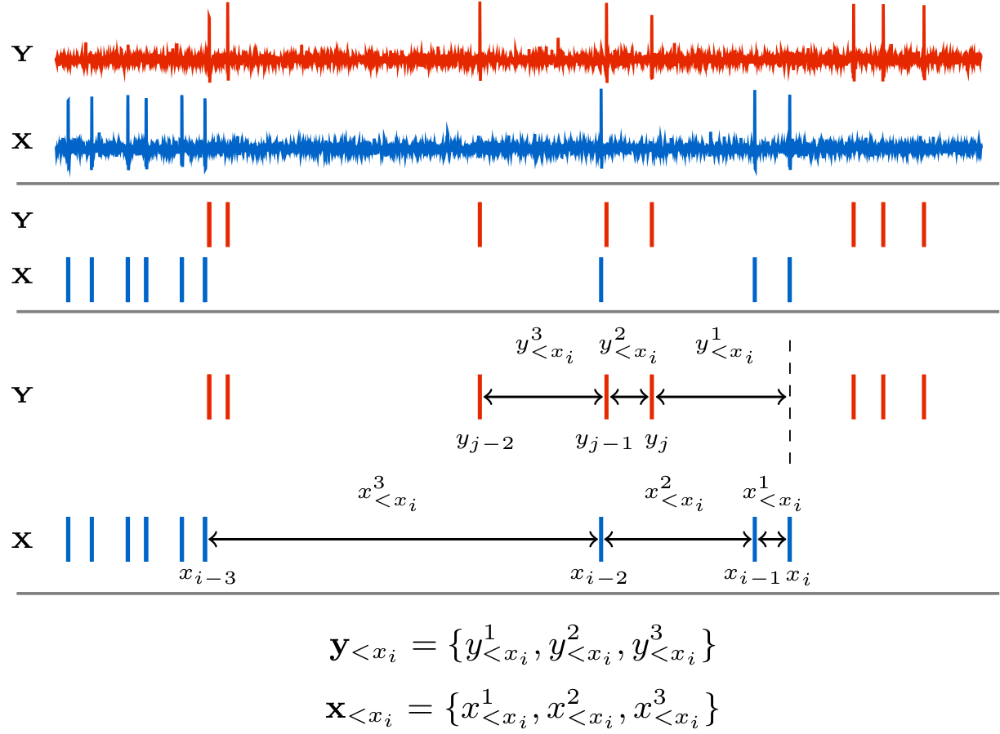

# CoTETE.jl

*Continuous-Time Event-based Transfer Entropy*

```@meta
CurrentModule = CoTETE
```

This package allows one to estimate the Transfer Entropy (TE) between event-based time series
(such as spike trains or social media post times) in continuous time (that is, without discretising
time into bins).

It contains implementations of the estimator and local permutation scheme presented in
[Estimating Transfer Entropy in Continuous Time Between Neural Spike Trains or Other
Event-Based Data](https://doi.org/10.1101/2020.06.16.154377).

Transfer entropy is a measure of information flow between a source and a target time series [^1][^2].
In the context of event-based data, it measures how much the knowledge of the times of historic events
in the source decreases our uncertainty about the occurrence of events in the target.
Getting a clearer picture of what TE is measuring is easiest done, initially at least, in discrete time.


The above diagram shows the raw membrane potentials of two neurons from which spikes are extracted.
Time is then discretised into bins of width ``\Delta t`` to give us two binary time series (labelled
``X`` and ``Y`` for the source and target, respectively). The binary values these processes take on
signify the presence of an event (spike) in the bin. For each such value ``x_t`` in the target
process, we can ask what the probability of that value is given the history of the target
process ``p(x_t \, | \, \mathbf{x}_{<t})``. In practice, such conditional probabilities can only be estimated for histories
of limited length. As such, we use a history embedding of ``m`` bins. This embedding is usually chosen to be the ``m`` bins
preceding the ``t``-th bin under consideration. In the above diagram, ``m`` is chosen to be 4, and so we are estimating
``p(x_t \, | \, \mathbf{x}_{t-4:t-1})``. So, for the specific example ``x_t`` pulled out of the diagram,
we are asking what the probability of the bin having a value of ``0`` is (that is, the probability
of there being no spike in the bin), given that the preceding ``4`` bins were ``\{0, 1, 0, 0\}``.

We can also ask what the probability of ``x_t`` is given history embeddings of both the source and
the target: ``p(x_t \, | \, \mathbf{x}_{t-4:t-1}, \mathbf{y}_{t-4:t-1})``. Looking at our specific
pulled-out example again, we would be asking for the probability of the target bin having a value of
``0`` given that the preceding ``4`` bins of the target were ``\{0, 1, 0, 0\}`` and the preceding
``4`` bins of the source were ``\{0, 1, 0, 1\}``.

We can then compare the probabilities ``p(x_t \, | \, \mathbf{x}_{t-4:t-1}, \mathbf{y}_{t-4:t-1})``
and ``p(x_t \, | \, \mathbf{x}_{t-4:t-1})`` to determine whether the knowledge of the source reduced
our uncertainty about the next state of the target.
If ``p(x_t \, | \, \mathbf{x}_{t-4:t-1}, \mathbf{y}_{t-4:t-1}) > p(x_t \, | \, \mathbf{x}_{t-4:t-1})``
then the source allowed us to better predict the next state of the target and so reduced our uncertainty.
Conversely, if ``p(x_t \, | \, \mathbf{x}_{t-4:t-1}, \mathbf{y}_{t-4:t-1}) < p(x_t \, | \, \mathbf{x}_{t-4:t-1})``
then the source was misinformative [^3].

One way of turning these two probabilities into a measurement of "informativeness" is to take the log
of their ratio. We shall label this ``\mathbf{t}_{Y \to X}``.
```math
 \mathbf{t}_{Y \to X} = \frac{p(x_t \, | \, \mathbf{x}_{<t}, \mathbf{y}_{<t})}{p(x_t \, | \, \mathbf{x}_{<t})}
```
We use ``\mathbf{t}_{Y \to X}^{l, m}`` for the same quantity calculated for specific source and target history
embedding lengths.
```math
 \mathbf{t}_{Y \to X}^{l, m} = \frac{p(x_t \, | \, \mathbf{x}_{t-m:t-1}, \mathbf{y}_{t-l:t-1})}{p(x_t \, | \, \mathbf{x}_{t-m:t-1})}
```

``\mathbf{t}_{Y \to X}`` will be positive in cases where the source is informative and negative when it is
misinformative. However, it is only a measure of how informative the source was in
*that specific time bin*. In many cases, such as network inference, we are interested in how
generally informative one time series is of another. As such we take the average of ``\mathbf{t}_{Y \to X}``
and label it ``\mathbf{T}_{Y \to X}``.
```math
\mathbf{T}_{Y \to X} = \frac{1}{N}\sum_{t=1}^{N}
\frac{
  p(x_t \, | \, \mathbf{x}_{<t}, \mathbf{y}_{<t})
  }{
    p(x_t \, | \, \mathbf{x}_{<t})
  }
```
The average here is taken over the ``N`` time bins of the target series. ``\mathbf{T}_{Y \to X}`` is
the transfer entropy. In order to ensure that it converges in the limit of small bin size, we normalise
it by the bin size ``\Delta t``, to arrive at the transfer entropy rate
``\mathbf{\dot{T}}_{Y \to X} = \frac{1}{\Delta t}\mathbf{T}_{Y \to X}``. This rate is the normalised
mutual information between the  current time bin of the target and the history of the source, conditioned
on the history of the target. That is:
```math
\dot{\mathbf{T}}_{Y\rightarrow X}
	=
	\frac{1}{\Delta t}
	I\left(
		X_t \, ; \, \mathbf{Y}_{<t}
		\, \middle| \,
		\mathbf{X}_{<t}
	\right)
```
Due to the fact that a mutual information can never be negative, the transfer entropy rate will
similarly never be negative.

The estimation of ``\mathbf{\dot{T}}_{Y \to X}`` on event-based data has traditionally been done in
a very straightforward fashion. After performing time discretisation, for each time bin ``t``, we
estimate the probability of the value in that bin given its history embedding,
``p(x_t \, | \, \mathbf{x}_{t-m:t-1})`` using a plug-in or histogram estimator. Specifically, we
find every occurrence of the embedding ``\mathbf{x}_{t-m:t-1}`` and record the values in the
subsequent bin. The estimated probability is then the number of times we observed the same value as
``x_t`` divided by the total number of values recorded. Going back to our example, for the specific
bin pulled out, we would find all instances of the pattern ``\{0, 1, 0, 0\}`` in the discretised
time series. We would then count how many of these instances were followed by a ``0``. The estimated
conditional probability is then the ratio of the number of instances follwed by a ``0`` to the total
number of instances. ``p(x_t \, | \, \mathbf{x}_{t-m:t-1}, \mathbf{y}_{t-l:t-1})`` is estimated in
a similar fashion, except we are now looking for instances where both
``\mathbf{x}_{t-m:t-1}`` and ``\mathbf{y}_{t-l:t-1}`` match. We repeat this procedure for every time
bin, find the average, divide by ``\Delta t`` and, wham, we have estimated the TE!!
(There are more computationally efficient ways of arriving at the same quantity)

Unfortunately, there are large limitations to estimating the TE in this fashion. Perhaps the most
important of these is that when we perform time-discretisation, we are applying a lossy transformation
to the data. So long as our bin size is larger than the time precision of the device used to record
our data (as is usually the case), once the discretisation has been performed we cannot reconstruct
the original time series in full detail. The implication of this is that the estimator is not guaranteed
to converge to the true value of the TE in the limit of infinite data (it is not consistent). Another
large limitation relates to our choice of bin size. The number of different history combinations grows
exponentially in the number of bins that we use. On most computer this will limit us to a total budget
of 20 to 25 bins accross all embeddings before we run out of memory. If we want to capture the influence of
events that far in the past we can use large bins. On the other hand, if we want to capture relationships
that occurr with fine time precision we can use smaller bins. However, we cannot capture both simultaneously.
This estimation scheme also provides estimates that are systematically far from the true value when
it is provided with smaller datasets (it has high bias). This problem is compounded by the fact that
its convergence to the true value is slow (see [our paper](https://doi.org/10.1101/2020.06.16.154377)
for examples).

CoTETE.jl presents an implementation of an estimator that is able to bypass these issues. It operates
in continuous time on the raw timestamps of the events. This allows it to be consistent and also capture
dependencies over relatively long ranges without any loss of precision. It also exhibits bias and
convergence properties that are far superior to the discrete time approach (see
[our paper](https://doi.org/10.1101/2020.06.16.154377) for examples). The below figure gives a diagram
of how the history embeddings are represented in our approach.



The estimator makes use of a [recent result](doi.org/10.1103/PhysRevE.95.032319) which showed that, for stationary
event based data, the TE rate can be expressed as:

## Contents
```@contents
Pages = ["quickStart.md", "public.md", "internals.md"]
Depth = 3
```

## Acknowledgements
The estimator implemented here was developed in collaboration with my PhD supervisor, Joe Lizier,
as well as Richard Spinney.


## Other Software
If you would like to apply TE to other data modalities, the [JIDT](https://github.com/jlizier/jidt) toolkit is highly
recommended.


## References

[^1] Schreiber, T. (2000). Measuring information transfer. Physical review letters, 85(2), 461.

[^2] Bossomaier, T., Barnett, L., Harré, M., & Lizier, J. T. (2016). An introduction to transfer entropy. Cham: Springer International Publishing 65-95.

[^3] Lizier, J. T. (2012). The local information dynamics of distributed computation in complex systems. Springer Science & Business Media.
